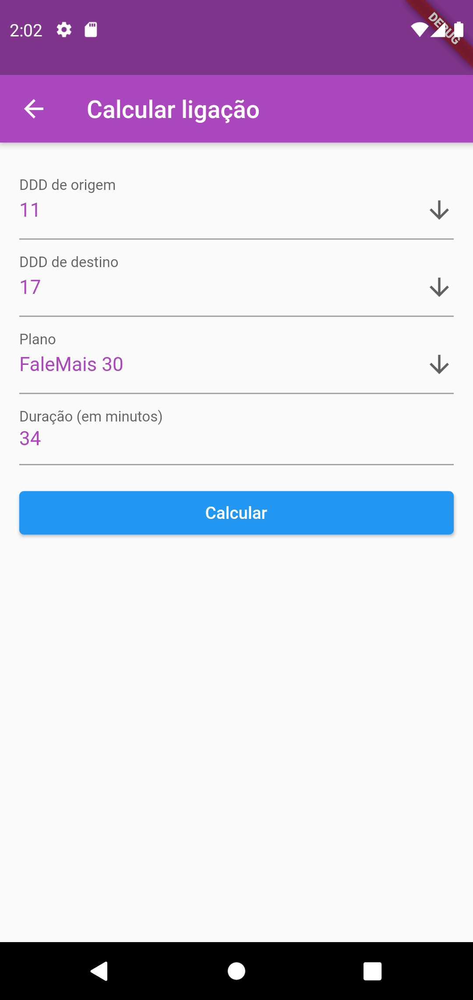

# falemais

A flutter application to calculate the call price according to selected plan.

### Home


### Form screen


### Result screen


## Getting Started

### Running the application

This delivery includes an Android APK file so that you can easily test the application.
To install the App, you can simply click the file from your Android phone and you will
be asked to install the app.

If you have an Android ADK available in you computer, you can install with the command:
```
adb install falemais.apk
```

### Running Flutter project

To run the project, you need the Flutter SDK and a Code Editor to edit the files.

#### Install Flutter SDK

Find [here](https://flutter.dev/docs/get-started/install) instructions to install Flutter SDK. 

#### Install a Code Editor

Flutter development tools are available for Android Studio, Intellij or Visual Studio Code.
You can find more details [here](https://flutter.dev/docs/get-started/editor)  
